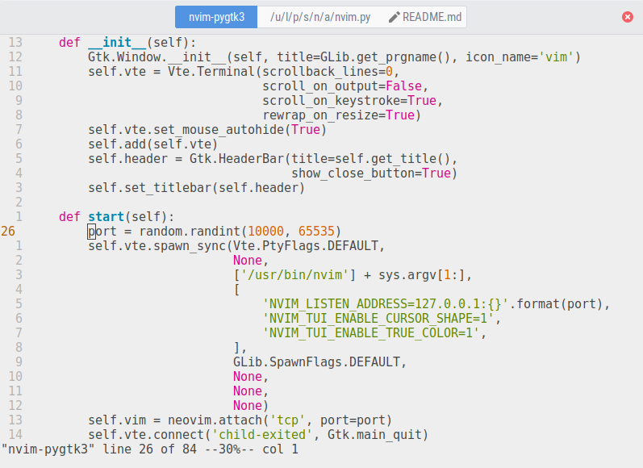

# nvim-pygtk3

PyGTK3 frontend to Neovim with some visual GUI elements.

* Provides GTK's clipboard (no need for xclip/xsel)
* Buffers on header bar
* GUI Tabs
* Overlay scrollbars
* Applies GTK's light/dark themes according to `&bg`
* Applies font from `:GuiFont`, or from GSettings'
  `org.gnome.desktop.interface:monospace-font-name`
* Customizable with Python scripts

## Preview



## Installation

Requirements:

* `python-setuptools` (make)
* `python-neovim`
* `python-gobject`
* `vte3`

Per-user:

```sh
$ python setup.py install --user --root=/
```

System-wide:

```sh
$ sudo python setup.py install --root=/
```

## Python scripts

Scripts in `$XDG_CONFIG_HOME/nvim_pygtk3/*.py` are `exec`'d at startup,
exposing the following globals:

* `connect`: Utility wrapper to connect GObject signals.
* `window`: The GTK top-level window.
  [Docs](https://developer.gnome.org/gtk3/unstable/GtkApplicationWindow.html)
  * `window.terminal`: The VTE terminal that hosts neovim.
    [Docs](https://developer.gnome.org/vte/unstable/VteTerminal.html)
  * `window.switcher`: The GtkStackSwitcher that displays buffers.
    [Docs](https://developer.gnome.org/gtk3/unstable/GtkStackSwitcher.html)
  * `window.notebook`: The GtkNotebook that displays tabs.
    [Docs](https://developer.gnome.org/gtk3/unstable/GtkNotebook.html)
  * `window.viewport`: The GtkViewport that holds the terminal.
    [Docs](https://developer.gnome.org/gtk3/unstable/GtkViewport.html)

The `window` object has the following additional signals:

* `nvim-setup`: Emitted when neovim has started.
* `nvim-notify`: Emitted when neovim has notified the GUI.
* `nvim-request`: Emitted when neovim has requested the GUI.

Example script `~/.config/nvim_pygtk3/a.py`:

```python
@connect(window, 'nvim-setup')
def a(nvim):
    nvim.command(f'call rpcnotify({nvim.channel_id}, "hello", "world")')

@connect(window, 'nvim-notify')
def b(nvim, event, args):
    if event == 'hello':
        print('hello', args)

@connect(window.terminal, 'cursor-moved')
def c():
    print('cursor moved!')
```
